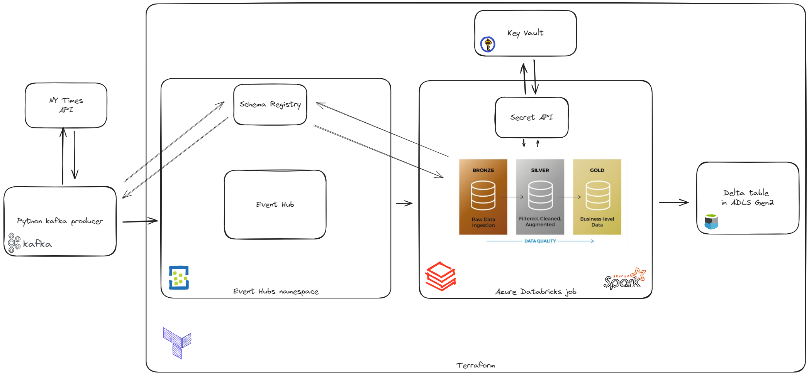

# Kafka streaming pipeline for New York Times bestseller list API
This project extracts of bestseller list from New York Times API and stores the data in a Kafka topic. The data is then consumed by a Databricks scheduled notebook.

#### Used libraries and tools
[![Databricks][Databricks]][Databricks-url] [![Kafka][Kafka]][Kafka-url] [![AzureSchemaRegistry][AzureSchemaRegistry]][AzureSchemaRegistry-url] [![Avro][Avro]][Avro-url] [![Terraform][Terraform]][Terraform-url]

## Project structure
The data originates from New York Times API and is extracted by a Kafka producer. Kafka producer is a Python script that fetches the data from the API and sends it to a Kafka topic. The data is serialized using Avro and the schema is stored in Azure Schema Registry.

The topic is created in an Event Hub in Azure. 

The data is then consumed by a Databricks notebook. The notebook is scheduled to run every week. To access the Event Hub, the notebook uses the Event Hub connection string stored in Azure Key Vault. Transformation and processing of the data is done with PySpark.

After transformation and enrichment, the data is stored in a Delta table in Azure Data Lake Storage Gen2.

## Terraform
The infrastructure is defined using Terraform. The Terraform script creates the following resources:
- Event Hub Namespace and Event Hub
- Storage Account and Container
- Databricks Workspace
- Key Vault

<!-- MARKDOWN LINKS & IMAGES -->
[Databricks]: https://img.shields.io/badge/Databricks-FF8135?style=for-the-badge&logo=databricks
[Databricks-url]: https://databricks.com/

[Kafka]: https://img.shields.io/badge/Kafka-231F20?style=for-the-badge&logo=apache-kafka
[Kafka-url]: https://kafka.apache.org/

[AzureSchemaRegistry]: https://img.shields.io/badge/Azure%20Schema%20Registry-2560E0?style=for-the-badge&logo=microsoft-azure
[AzureSchemaRegistry-url]: https://azure.microsoft.com/en-us/services/schema-registry/

[Avro]: https://img.shields.io/badge/Avro-0041C2?style=for-the-badge&logo=apache-avro
[Avro-url]: https://avro.apache.org/

[Terraform]: https://img.shields.io/badge/Terraform-623CE4?style=for-the-badge&logo=terraform
[Terraform-url]: https://www.terraform.io/
